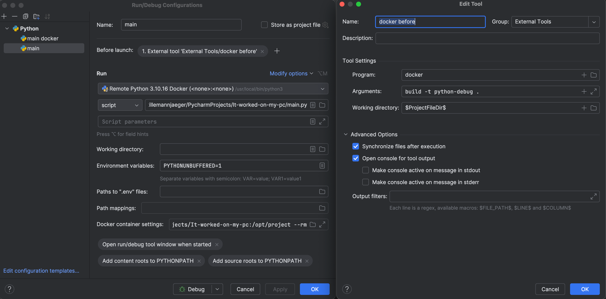

# It-worked-on-my-pc

Data scientist are have started using some of the common software best practices. However, running the code in docker container is still something we have not started on
. This repo is made for show casing the best practices on how to do it

## Required: 
Pycharm 

Docker

## Tutorial

Use the DockerFile in this repo or create a new Dockerfile 

Settings | Project | Python Interpreter | add interpreter

getting the docker to buildt the image before each run 

Go to Edit configuration | Run/debug interpreter 

setup: the before launch -> 

``